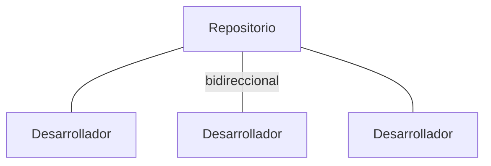
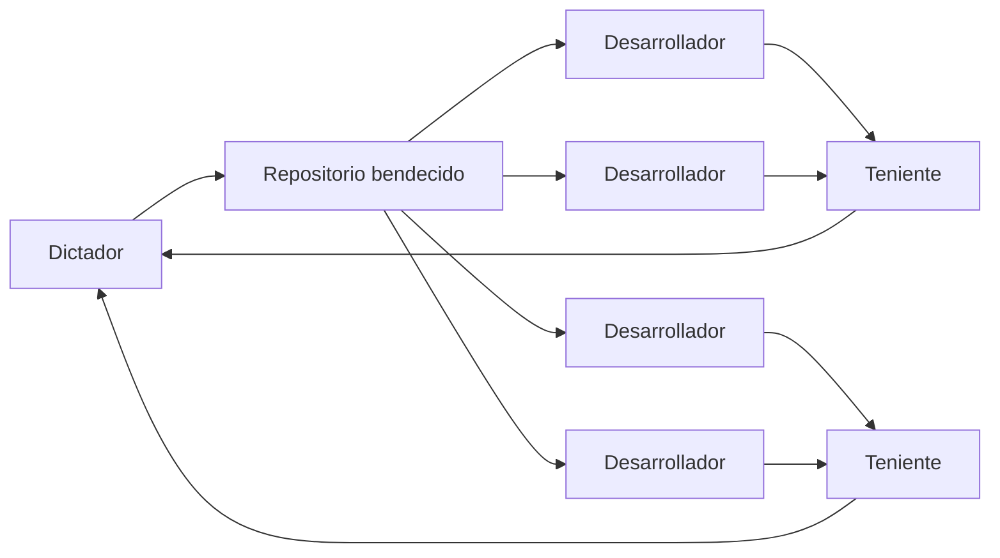
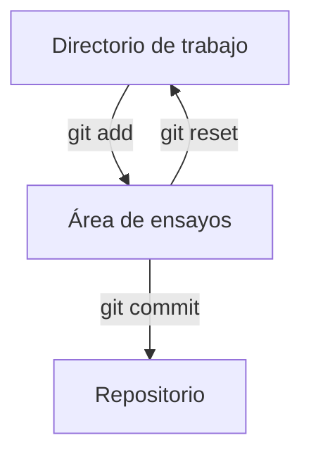
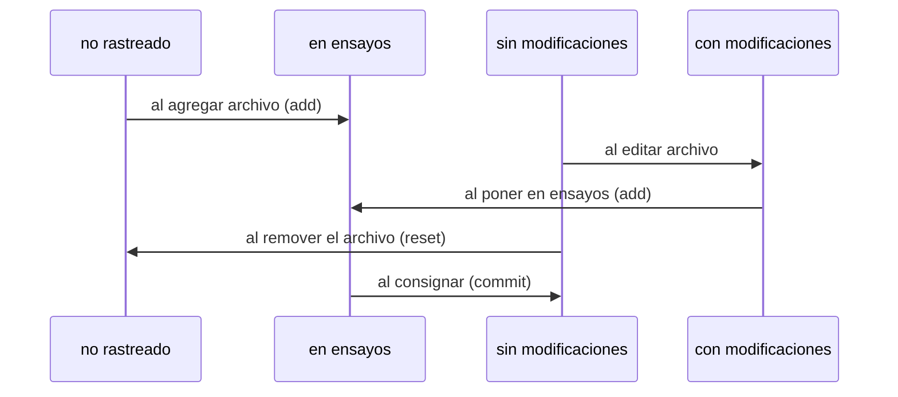
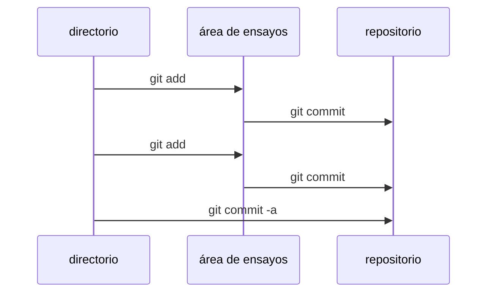
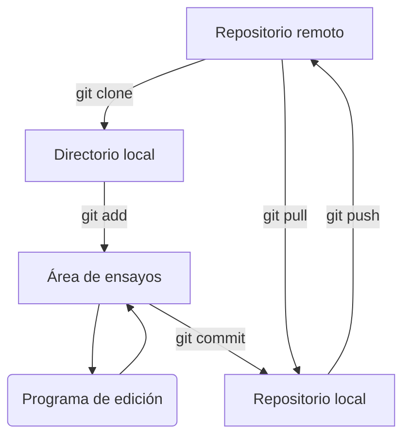
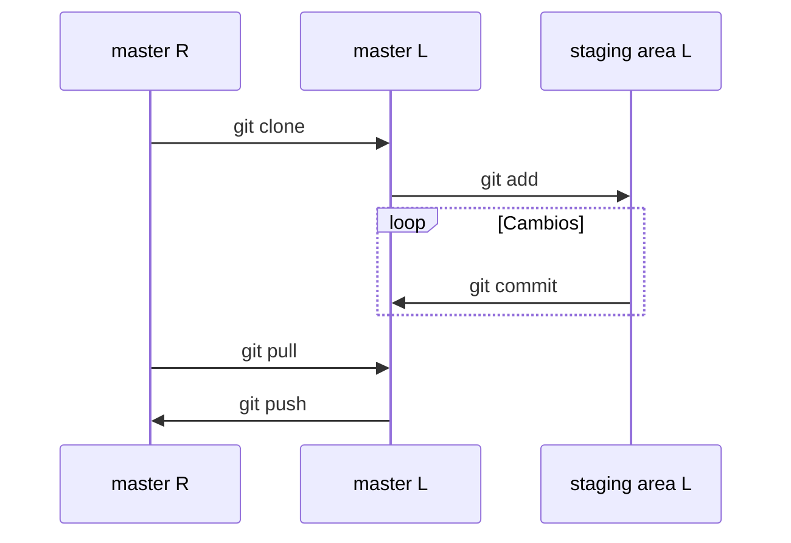
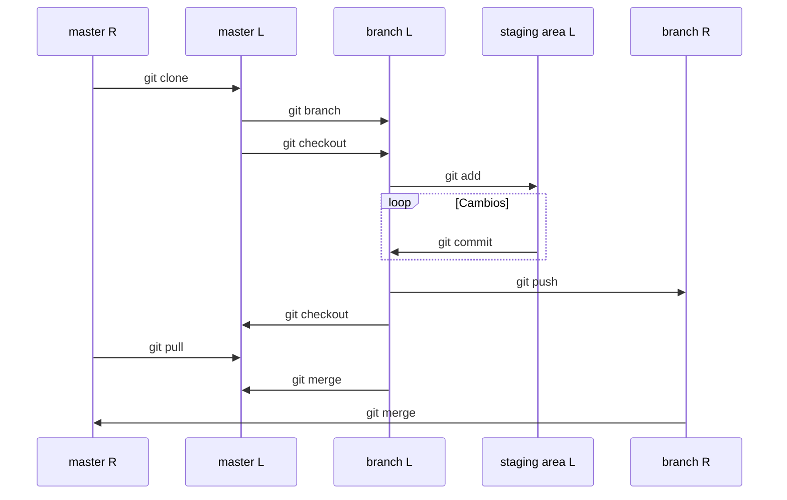

---
### Universidad de Costa Rica
#### IE0405 - Modelos Probabilísticos de Señales y Sistemas
---

# `Git0` - *Introducción a Git*

> Git es un sistema de control de versiones (**VCS**, *version control system*) para monitorear cambios en archivos de código fuente. 

---

Git permite:

* Hacer control distribuido (no centralizado) de versiones.
* Coordinar el trabajo entre múltiples desarrolladores.
* Especificar cuáles cambios fueron hechos y quiénes y cuándo los hicieron.
* Retornar a versiones anteriores del código.
* Utilizar "repositorios" locales y remotos.

## Características

En la página oficial de Git ([https://git-scm.com/about/](https://git-scm.com/about/)) hay una descripción de sus principales bondades:

### a) Ramificación y fusión (o unión: *branching and merging*)

Git está basado en un modelo de "ramificación", en el cual se pueden hacer *branches* (ramas) completamente independientes y con distintos propósitos, por ejemplo: 

* Una rama principal con el código "en producción", "estable"
* Una rama de prueba de prototipos o ideas
* Una rama de ensayo de nuevas características

Todas estas ramificaciones pueden luego fusionarse con la principal (conocida como *master branch* o "rama maestra") o desecharse. Se pueden hacer tantas ramificaciones como se desee (y ramificaciones de ramificaciones) y se puede fusionar luego una, algunas o todas ellas.

### b) Área de ensayos

Es un área intermedia en la que se monitorean los cambios, se verifica su funcionalidad y luego se envía al repositorio.

### c) Sistema distribuido

Cada usuario tiene un respaldo completo (o "clon") del servidor principal (ya sea local o remoto). Esto permite restablecer el trabajo en caso de fallos en el servidor principal.

#### Modelos de flujo de trabajo

Por el sistema de ramificaciones descrito, la forma en que fluye el código y se aprueba su reincorporación a la rama principal varía según la circunstancia, pero las opciones de configuración son casi ilimitadas. Dos ejemplos:

##### Modelo colaborativo

Todos los desarrolladores aportan al repositorio directamente.


##### Modelo del "dictador"

Una sola persona (o grupo pequeño) autoriza los cambios que ingresan al repositorio "bendecido".



### d) Seguridad de los datos

Todos los bits que se gestionan en Git tienen "seguridad criptográfica", es decir, serán exactamente los que se escribieron.

## Y antes de seguir: ¿cómo instalar Git?

Desde la página de [git-scm]([https://git-scm.com/download/](https://git-scm.com/download/)) se debe utilizar el método de instalación indicado para cada sistema operativo. Desde la terminal (**CLI**, *command line interface*) puede ser, por ejemplo:

Debian/Ubuntu
: `# apt-get install git`

macOS
: `$ brew install git`

Windows
: *Descarga e instalación manual*

Una vez instalado, en la misma terminal se puede probar que funciona correctamente ejecutando algunas de las siguientes instrucciones:


`$ git`
: muestra una descripción de las opciones que tiene

`$ git --version`
: muestra la versión (ejemplo: 2.24.2)

`$ git help tutorial`
: abre el editor de texto en terminal (`less` u otro) donde se muestra un paso a paso de "cómo importar un nuevo proyecto en Git, hacerle cambios y compartir los cambios con otras/os desarrolladoras/es" (tecla `q` para salir del tutorial).

## Ubicaciones de los archivos

Git funciona dentro de un directorio monitoreado desde una carpeta `.git` (oculta) que se crea ahí al ejecutar

```bash
git init
```

Luego de eso, Git define "lugares" o ubicaciones en donde se mueven los archivos, a saber:



### *Working directory*[^1] (directorio de trabajo)

> Cambios no monitoreados

Es el directorio local donde el usuario tiene almacenados los archivos ligados al proyecto.

### *Staging area*[^2] o *index* (área de ensayos)

> Cambios monitoreados pero no enviados al repositorio

Es donde el usuario va a agregar los archivos que modifica para luego guardarlos en el repositorio. Los cambios que aquí suceden "dejan rastro" en Git, esto a diferencia de cambios en archivos comunes, que solamente guardan la última versión.

### *Repository*[^3] (repositorio)

> Versión estable

Es el lugar donde se encuentran los archivos con los cambios realizados y consolidados por todos los desarrolladores participantes en las diferentes ramas. Puede ser local o remoto (ver sección *Servidores remotos de Git*).

## Estado de los archivos

Hay cuatro estados posibles para el archivo en Git:

*Untracked* (no rastreado)
: sfasdfasd

*Unmodified* (sin modificaciones)
: asdfasdf

*Modified* (con modificaciones)
: asdf

*Staged* (en ensayos)
: asdfas

Ciertas acciones de Git trasladan al archivo entre un estado y otro:



##  Primero lo primero

Deberíamos "presentarnos" con Git, es decir, indicar quién hace los cambios en un proyecto. En la terminal se procede con:

```bash
git config --global user.name "Nombre"
git config --global user.email you@yourdomain.example.com
```

Se pueden revisar los datos guardados con `$ git config user.name` y `$ git config user.email`. En general, todos esos datos se revisan con:

```bash
git config --list
```

### Segundo lo segundo

Git tiene "verbos" (o instrucciones o acciones o comandos, como se verá más adelante: *init*, *add*, *push*, *pull*…). Para obtener información y ayuda sobre ellos directamente desde Git, se utilizan las instrucciones en la terminal:

```bash
git help <verbo>
git <verbo> --help
```

### Tercero lo tercero

Recordatorio de las instrucciones básicas del **CLI** (*command line interface*, llamada "terminal" o "consola"), según ambiente operativo:

| **Unix** | **Win** | *Función* | 
|--|--|--|
| `pwd` | `echo %cd%` | (*print working directory*) mostrar el directorio actual |
| `ls` | `dir` | (*list*) mostrar los elementos en el directorio actual |
| `cd` | `cd` | (*change directory*) cambiar de directorio |
| `rm` | `del` | (*remove*) eliminar un archivo o directorio |
| `mkdir` | `mkdir` | (*make directory*) hacer un nuevo directorio |
| `.` | `.` | Este directorio |
| `..` | `..` | El directorio que contiene al actual |

### Cuarto lo cuarto

Los siguientes son comandos esenciales que se aplican sobre el directorio actual (se aplican con `git <comando> [otras opciones]`):

| Comando | Descripción |
|--|--|
| `init` | Iniciar un proyecto nuevo usando Git, que se traslada al *working directory* (directorio de trabajo). |
| `add` | Pasar los archivos del *working directory* al *staging area* (área de ensayos). Aquí se hará, posiblemente, multitud de cambios y pruebas del código antes de pasar al repositorio. |
| `status` | Consultar en qué estado se encuentran los archivos. Pueden estar en el *área de ensayos* (donde se monitorean sus cambios) o solamente en el *directorio de trabajo* (donde **no** se monitorean sus cambios). |
| `commit` | Guardar una versión del código en el repositorio. |
| `clone` | Hacer una copia desde un servidor central (local o remoto) donde está un repositorio hasta la computadora del usuario para trabajar en este. |
| `push` | Subir los cambios que realiza el usuario a un repositorio remoto. Si el repositorio está en un servicio web y es de una cuenta propia, va a solicitar los datos de ingreso (usuario, contraseña). |
| `pull` | En el caso que el usuario esté trabajando con otros desarrolladores, con este comando descarga los cambios realizados por los otros desarrolladores u otras instancias. |

## *Ejemplo 1*: trabajar en un repositorio local

### Inicializar el seguimiento de un nuevo directorio

1. Crear una carpeta (folder, directorio) en cualquier parte, por ejemplo en el escritorio. Aquí es donde se van a almacenar localmente los archivos.
2. Crear un archivo cualquiera. Por ejemplo, un archivo `.txt` con cualquier texto.
3. En la terminal, ubicarse en el directorio de trabajo con la instrucción de terminal `$ cd <path>`.
4. Inicializar Git dentro de esta carpeta con `$ git init`. Esto va a crear una carpeta oculta en este directorio donde Git almacenará la información relevante para su funcionamiento.
5. Puede corroborarse ahora el estatus en esta carpeta con `$ git status`.  Aquí posiblemente salga un mensaje como *On branch master* y *No commits yet* junto con una lista de *Untracked files*, es decir, archivos que están en la carpeta pero que no han sido incluidos en lo que va a ser monitoreado por Git (en el *área de ensayos*).

### Agregar archivos al área de ensayos

6. Para agregar al *área de ensayos* uno de los archivos presentes, es necesaria la ejecución de `$ git add <archivo>` (incluyendo la extensión). **Nota**: para agregar *todos* los archivos se puede usar `$ git add .` (con el punto) o `$ git add -A`.
7. Luego de agregar un archivo con la instrucción anterior, se verifica de nuevo con `$ git status`. Si fue exitosa la adición, aparecerá ahora *Changes to be commited* y *new file: `<archivo>`*. En general, con `$ git status` habrá una lista de archivos en la carpeta de trabajo que están monitoreados por Git y los otros que no.
8. Ahora se pueden hacer algunos cambios en `<archivo>` en cualquier editor (en el caso de un `.txt` puede ser Sublime, etc.) y guardar esos cambios.
9. Al verificar nuevamente con `$ git status` aparece como *modified*.

### Enviar cambios al repositorio

10. Ejecutar ahora `$ git commit`.
11. Ahora aparecerá un editor de texto dentro de la misma terminal: o bien *VIM*, o *vi*, o *gedit*. Aquí es obligatorio introducir un texto que acompaña el primer `commit`. Debe ser un texto **suficientemente descriptivo**. **Nota**: un *peligro* aquí: ¿cómo salir del editor? La respuesta es indeseablemente críptica: `Esc` + `:` + `w` (*write*) + `q` (*quit*).
12. Alternativa y **recomendación**: con `$ git commit -m "El mensaje explicatorio del commit."` no se necesita ningún editor, sino que ya va incluido el mensaje obligatorio.
13. Con `$ git log` se mostrará el "hash" (identificador único) del *commit* y el autor y fecha.
14. Al modificar de nuevo `<archivo>.txt` y guardar los cambios, `$ git status` va a mostrar *Changes not staged for commit: modified: archivo.txt*. Falta entonces llevar el archivo de nuevo al área de ensayos con `$ git add <archivo>.txt`
15. Si ahora nuevamente guardamos los cambios en el repositorio con `$ git commit -m "Nuevo mensaje por el segundo commit."`, veremos algo como *"1 file changed, 2 insertions(+), 2 deletions(-)"*
16. Es posible "tomar un atajo" desde el directorio al repositorio con `git commit -a`.



#### Resumen de comandos nuevos utilizados

| Comando | Descripción |
|--|--|
| `add .` o `add -A` | Agregar *todos* los archivos del directorio de trabajo al *staging area* o *index*. |
| `commit -m "Mensaje."` | Agregar comentario directamente para guardar los cambios en el repositorio. Este comentario es obligatorio y de otra forma se hace en un editor de texto CLI como VIM. |
| `commit -a` | Identificar archivos modificados (pero no nuevos), agregarlos al *index* y guardar en el repositorio en un solo paso. Equivalente a `add` + `commit`. |


## Servidores remotos de Git

Parte de la utilidad de Git es poder interactuar en la edición de software con personas en distintos lugares. Para eso está la web. Ahora el flujo de trabajo puede ser como el siguiente:



Hay varios motivos por los que nos puede interesar copiar ("**clonar**") los archivos de un repositorio remoto (*"repo"*, en el lingo):

* Para usar el código de forma aislada, sin participar realmente de su desarrollo
* Para agregar funcionalidades o avanzar en un código principal (usualmente en un proyecto individual)
* Para probar funcionalidades en un *branch* o ramificación de prueba y luego agregarlo a la rama principal (usualmente en un proyecto colectivo)

### Servicios web

#### GitHub

En este curso, los archivos estarán almacenados en un repositorio de GitHub, que es un popular servicio de alojamiento de repositorios y colaboración:

[fabianabarca/mpss]([https://github.com/fabianabarca/mpss](https://github.com/fabianabarca/mpss))

#### Otros sistemas Git

Además de GitHub, existen también:

* GitLab
* BitBucket
* Launchpad
* Deveo
* RhodeCode
* Gitea

La Escuela de Ingeniería Eléctrica tiene un servidor de Git con Gitea, disponible en [https://git.eie.ucr.ac.cr/](https://git.eie.ucr.ac.cr/).

### Cómo clonar un repositorio remoto

```bash
git clone <url> <lugar para clonar>
```

#### Ejemplos

```bash
git clone ../carpeta/ .
git https://gitlab.com/inkscape/inkscape.git inkscape
```

**Nota**: como se observa, `<url>` puede en realidad ser otro directorio dentro de la computadora. El punto `.` quiere decir "en el directorio actual".

## *Ejemplo 2*: clonar desde un repositorio remoto

1. En la computadora personal, en la carpeta del curso, se puede crear una nueva carpeta llamada `mpss` donde clonar el material de GitHub del curso, que incluye los "cuadernos" de Jupyter del curso y otros materiales.
2. Para hacer un "clon" del tutorial `Py0` - *Introducción a Python* para ejecutar localmente. El archivo `Py0.ipynb` está alojado en GitHub en la dirección [https://github.com/fabianabarca/git0.git](https://github.com/fabianabarca/mpss.git). Si `pwd` es `.../mpss/`, entonces:

```bash 
git clone https://github.com/fabianabarca/mpss.git .
```

Ahora es posible ejecutar Jupyter con los archivos ahí presentes para asuntos relacionados con el aprendizaje de Python y de la teoría de probabilidad. En general, no se espera que los estudiantes actualicen estos archivos en el repositorio de GitHub (porque no pueden si no son los propietarios de la cuenta), sino solamente que lo usen para fines didácticos personales. Si desean agregar alguna variación o hacer una sugerencia, lo pueden hacer directamente con el profesor.

## *Ejemplo 3*: clonar desde un repositorio remoto propio y actualizar los cambios de vuelta

1. Si usted crea un repositorio propio (por ejemplo, con cualquier archivo de texto) en GitHub, puede editarlo localmente y actualizarlo en la web siguiendo la siguiente secuencia:

Sea R: *remoto* y L: *local*:



### Chiste

**IN CASE OF FIRE**
1. `git commit`
2. `git push`
3. *Leave building*

Ja, ja.

## *Ejemplo 4*: trabajo colaborativo haciendo *fork* y *pull request* en el *master branch*

Perdonando el *spanglish* del título, es usual colaborar con otros usuarios de GitHub cuando se hace desde un servicio web de Git (como GitHub…) esto también se conoce como "hacer un *fork*", que es una *copia en el lado del servidor*, desde la cuenta del dueño del repositorio a la cuenta de la persona que hace *fork*, y es monitoreado por el servicio web en cuestión (*fork* **no es un comando de Git**).

### Hacer un *fork* (bifurcación)

1. Si no la tiene aún, favor hacer una cuenta gratuita en GitHub. Ahí puede buscar repositorios de software de usuarios de todo el mundo, que facilita el mejoramiento del código abierto.
2. Buscando [fabianabarca/git0](https://github.com/fabianabarca/mpss.git) puede hacer *fork* en el botón para este fin (arriba a la derecha). Esto va a crear una copia en su cuenta personal.

### Hacer un *pull request* (solicitud de extracción)

3. Luego de hacer cambios al repositorio copiado en la cuenta personal, es posible *sugerir* los cambios hechos para ser incorporados al repositorio original. Para esto se hace un *pull request* (solicitud de extracción), donde se envía al dueño del repositorio un recuento de los cambios hechos, que pueden ser aceptados y fusionados (*merge*) o el propietario puede devolver comentarios y sugerir cambios, o ninguno de los anteriores (*dejar en visto*).

## (Opcional) Hacer un *branch* (rama, ramificación)

Hacer modificaciones en una ramificación es una de las ventajas citadas de Git: se pueden hacer cambios para incorporar al programa principal luego, o simplemente hacer un programa nuevo a partir de ahí. 

Si R: *remoto* y L: *local*, el siguiente diagrama nos ayuda a visualizar la secuencia de cambios realizados.



## Para explorar más

Otros comandos son importantes para trabajar con Git, entre ellos:

`$ git diff`
: Para ver el detalle de los cambios hechos en los archivos.

`$ git checkout`
: Para cambiar de trabajo entre ramas.

`$ git merge`
: Para unir dos desarrollos.

La lista completa está en [https://git-scm.com/docs](https://git-scm.com/docs).

### Más información

* El libro [Pro Git]([https://git-scm.com/book/es/v2](https://git-scm.com/book/es/v2)) (disponible en español) es una revisión exhaustiva de las características de Git.
* "Git y Github | Curso Práctico de Git y Github Desde Cero" es un tutorial en video por Fazt en [YouTube](https://youtu.be/HiXLkL42tMU)
* "Git Tutorial for Beginners: Command-Line Fundamentals" es un tutorial en video por Corey Schafer en [YouTube](https://youtu.be/HVsySz-h9r4)


## Sobre este documento

2020 - Fabián Abarca Calderón, editado en [StackEdit](https://stackedit.io/)

[^1]: *"Working directory"*: | ˈwərkiNG diˈrektərē |
[^2]: *"Staging area"*: | ˈstājiNG ˈerēə |
[^3]: *"Repository"*: | rəˈpäzəˌtôrē |
